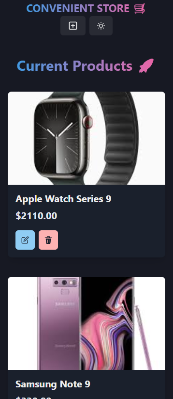

# Convenient Store

## Table of Contents

<!-- prettier-ignore-start -->

- [About the Project](#about-the-project)<br>
- [Demo](#demo)<br>
- [Tech Stacks](#tech-stacks)<br>
- [Setup](#setup)<br>
  - [Prerequisites](#prerequisites)<br>
  - [Installation](#installation)<br>
- [Repository Structure](#repository-structure)<br>

<!-- prettier-ignore-end -->

---

## About the Project

<picture>
  <picture>
  <source media="(min-width: 1280px)" srcset="./assets/images/Desktop.png">
  <source media="(min-width: 768px)" srcset="./assets/images/Tablet.png">
  
</picture>
</picture>

I have built a product store app called Convenient Store using MERN stack. Despite the fact that there are product store that exists, the idea of this product store naming came from the fact that this is a convenient way to get product while relaxing at your home.

---

## Demo

You can access the app [here](https://convenient-store.onrender.com/).

---

## Tech Stacks

- Frontend: Vite + Chakra UI + Zustand
- Language: JavaScript
- Backend: Node + Express
- Database: MongoDB
- Hosting: Render

---

## Setup

### Prerequisites

- Node 22+
- MongoDB Cluster (Database)

### Installation

1. Clone the repository

```
git clone https://github.com/abdulgilani/convenient-store
```

2. Install Dependencies

```
cd backend && npm i
cd ../frontend && npm i
```

3. Environment Setup

```
cp backend/.env.example backend/.env
```

4. Development

```
# Run the backend
cd backend && npm run dev
```

```
# Run the frontend
cd frontend && npm run dev
```

5. Production Build

```
npm run build
npm run start
```

Visit http://localhost:5000/api

## Repository Structure

```
convenient-store
├── README.md
├── backend
│   ├── .env.example
│   └── src
│       ├── /config                                 # DB Configs
│       ├── /controller                             # Product Controllers
│       ├── index.js                                # Main express server entry
│       ├── /model                                  # Product Model
│       └── /routes                                 # Product Routes
├── frontend
│   ├── index.html
│   ├── src
│   │   ├── App.jsx                                 # Main Routing Setup
│   │   ├── /components                             # UI Components (Navbar, ProductCard)
│   │   ├── main.jsx                                # React Entry Point
│   │   ├── /pages                                  # App Pages (CreatePage, HomePage)
│   │   └── /store                                  # State Management Product Store
│   └── vite.config.js
└── package.json
```
